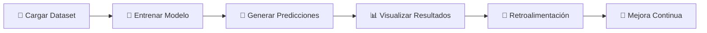

# 🌦️ Sistema de Predicción Meteorológica para Microclimas

<div align="center">


[](https://github.com/brrojash/Proyecto-microclima-estacion-meteorologica)
[](https://www.ucundinamarca.edu.co/)
[](LICENSE)

</div>

## 📋 Descripción

Sistema avanzado de predicción meteorológica especializado en microclimas de alta montaña, desarrollado específicamente para **Facatativá, Colombia** (altitud ~2600m). Este proyecto de grado **completado exitosamente** combina inteligencia artificial, aprendizaje automático y monitoreo en tiempo real para proporcionar predicciones meteorológicas precisas y adaptadas a las condiciones climáticas locales.

## 🎯 Características Principales

- **🤖 Predicción con IA**: Modelos de deep learning (LSTM, redes neuronales) entrenados con TensorFlow/Keras
- **📊 Predicciones a 72 horas**: Pronósticos detallados por períodos del día (madrugada, mañana, tarde, noche)
- **🏔️ Especializado en microclimas**: Optimizado para condiciones de alta montaña (Sabana de Bogotá)
- **📡 Estación meteorológica integrada**: Monitoreo en tiempo real de variables climáticas
- **👤 Retroalimentación inteligente**: Sistema de aprendizaje que mejora con observaciones del usuario
- **📈 Visualizaciones avanzadas**: Gráficos interactivos de temperatura, confianza y tendencias
- **💾 Gestión de datos históricos**: Procesamiento de datasets desde 2018 hasta la actualidad
- **🔄 Actualización automática**: Integración continua de nuevos datos de sensores

## 🛠️ Stack Tecnológico

<table>
<tr>
<td align="center">

<br><strong>Python 3.8+</strong>
<br>Lenguaje Principal
</td>
<td align="center">

<br><strong>TensorFlow</strong>
<br>Deep Learning
</td>
<td align="center">

<br><strong>Scikit-learn</strong>
<br>Machine Learning
</td>
<td align="center">

<br><strong>Pandas</strong>
<br>Análisis de Datos
</td>
</tr>
<tr>
<td align="center">

<br><strong>NumPy</strong>
<br>Computación Numérica
</td>
<td align="center">

<br><strong>Matplotlib</strong>
<br>Visualización
</td>
<td align="center">

<br><strong>Seaborn</strong>
<br>Gráficos Estadísticos
</td>
<td align="center">

<br><strong>Tkinter</strong>
<br>Interfaz Gráfica
</td>
</tr>
</table>

## 🌡️ Variables Monitoreadas

| Variable | Unidad | Rango Típico | Descripción |
|----------|--------|--------------|-------------|
| 🌡️ **Temperatura** | °C | 8-20°C | Temperatura ambiente |
| 💧 **Humedad relativa** | % | 40-95% | Porcentaje de humedad |
| 🌧️ **Precipitación** | mm | 0-50mm/h | Lluvia acumulada |
| ☁️ **Cobertura de nubes** | octas | 0-8 | Nubosidad en escala octas |
| 💨 **Velocidad del viento** | km/h | 0-30km/h | Intensidad del viento |
| ☀️ **Radiación solar** | J/m² | 0-90000 | Energía solar recibida |

## 🔧 Requisitos del Sistema

### 📋 Dependencias Principales
```bash
Python >= 3.8
TensorFlow >= 2.8.0
pandas >= 1.3.0
numpy >= 1.21.0
matplotlib >= 3.5.0
seaborn >= 0.11.0
scikit-learn >= 1.0.0
tkinter (incluido en Python)
Pillow >= 8.0.0
joblib >= 1.0.0
```

### 💻 Hardware Recomendado
- **RAM**: Mínimo 8GB (recomendado 16GB)
- **CPU**: Procesador multi-núcleo (el sistema usa hasta 28 hilos)
- **Almacenamiento**: Al menos 2GB de espacio libre
- **Resolución**: Mínimo 1024x768 (recomendado 1920x1080)

## 📦 Instalación

### 1️⃣ Clonar el repositorio
```bash
git clone https://github.com/brrojash/Proyecto-microclima-estacion-meteorologica.git
cd Proyecto-microclima-estacion-meteorologica
```

### 2️⃣ Crear entorno virtual (recomendado)
```bash
# Windows
python -m venv microclima_env
microclima_env\Scripts\activate

# Linux/Mac
python3 -m venv microclima_env
source microclima_env/bin/activate
```

### 3️⃣ Instalar dependencias
```bash
pip install -r requirements.txt
```

### 4️⃣ Configurar directorio de imágenes
```bash
# Asegúrate de que existe la carpeta con iconos meteorológicos
ls Imagenes-Clima/
```

## 🚀 Uso

### ▶️ Iniciar la aplicación principal
```bash
python meteo_main.py
```

### 📈 Flujo de trabajo típico:



1. **📁 Cargar Dataset**: Selecciona un archivo CSV con datos históricos
2. **🧠 Entrenar Modelo**: Configura parámetros y entrena el modelo de IA
3. **🔮 Generar Predicciones**: Obtén pronósticos para las próximas 72 horas
4. **📊 Visualizar Resultados**: Explora gráficos interactivos y pronósticos detallados
5. **👤 Proporcionar Retroalimentación**: Mejora el modelo con observaciones reales

### 🌡️ Estación Meteorológica
```bash
# Para usar la interfaz de la estación meteorológica
python estacion_meteorologica.py
```

## 📁 Estructura del Proyecto

```
Proyecto-microclima-estacion-meteorologica/
├── 📄 meteo_main.py              # 🎯 Aplicación principal con GUI
├── 🧠 predictor_model.py         # 🤖 Modelos de machine learning
├── 📊 visualizaciones.py         # 📈 Sistema de gráficos y visualizaciones
├── 🌡️ estacion_meteorologica.py  # 📡 Interfaz de estación meteorológica
├── ⚙️ ProcesarDatosGUI.py        # 🔧 Procesador de datos de sensores
├── 🖼️ Imagenes-Clima/            # 🎨 Iconos meteorológicos
│   ├── Frio.png
│   ├── Soleado.png
│   ├── Nublado.png
│   └── ...
├── 📂 modelos/                   # 💾 Modelos entrenados guardados
├── 📈 datos_retroalimentacion/   # 💬 Feedback del usuario
├── 📋 requirements.txt           # 📦 Dependencias Python
├── 📖 README.md                  # 📚 Este archivo
└── 📄 LICENSE                    # ⚖️ Licencia del proyecto
```

## 🎮 Características de la Interfaz

### 🖥️ Ventana Principal
- **📁 Panel de carga de datos**: Importación de datasets CSV
- **⚙️ Configuración de entrenamiento**: Parámetros del modelo (épocas, learning rate, etc.)
- **📊 Monitor de progreso**: Seguimiento en tiempo real del entrenamiento
- **🔮 Panel de predicciones**: Resultados y exportación

### 📈 Visualizaciones Avanzadas
- **🌡️ Gráfico de temperatura**: Tendencias y niveles de confianza
- **📅 Pronóstico detallado**: Vista por períodos con retroalimentación
- **📉 Series temporales**: Análisis histórico de variables
- **📊 Distribuciones**: Estadísticas de condiciones climáticas

## 🧠 Arquitectura del Modelo de IA

### 🔧 Características técnicas:
- **Tipo**: LSTM Bidireccional con mecanismo de atención
- **Entrada**: Ventana temporal de 12 horas
- **Salida**: Predicciones categóricas para 72 horas
- **Optimización**: Adam con learning rate adaptativo
- **Regularización**: Dropout, L2, y BatchNormalization
- **Ensemble**: Opción de múltiples modelos para mayor precisión

### 🏷️ Categorías Climáticas:
```
🌡️ Temperatura:     ❄️ Frío / 🌤️ Templado / 🔥 Cálido
☁️ Nubosidad:       ☀️ Soleado / ⛅ Parcialmente Nublado / ☁️ Muy Nublado
🌧️ Precipitación:   💧 Lluvia Ligera / 🌦️ Llovizna / ⛈️ Lluvia Fuerte
💨 Humedad:         💧 Húmedo / 🌊 Muy Húmedo
🌫️ Especiales:      🌫️ Niebla / 🌬️ Viento Frío / ☀️ Alta Radiación
```

## 🔄 Sistema de Retroalimentación

El sistema incluye un mecanismo único de **aprendizaje continuo**:

- ✅ Los usuarios pueden corregir predicciones en tiempo real
- 💾 Las correcciones se almacenan y procesan automáticamente
- ⚖️ El modelo se actualiza con mayor peso para observaciones verificadas
- 📈 Mejora continua de la precisión basada en condiciones locales reales

## 📊 Formato de Datos

### 📄 Archivo CSV de entrada:
```csv
fecha,temperatura_C,humedad_relativa,precipitacion_mm,cobertura_nubes_octas,velocidad_viento_kmh,radiacion_solar_J_m2
2024-01-01 00:00:00,12.5,75.2,0.0,6.0,8.5,0
2024-01-01 01:00:00,11.8,78.1,0.0,7.0,7.2,0
2024-01-01 02:00:00,11.2,80.5,0.2,7.5,6.8,0
...
```

## 🌍 Contexto Geográfico

**📍 Ubicación**: Facatativá, Cundinamarca, Colombia

<table>
<tr>
<td><strong>🗺️ Latitud</strong></td>
<td>4.8167° N</td>
</tr>
<tr>
<td><strong>🗺️ Longitud</strong></td>
<td>74.3667° W</td>
</tr>
<tr>
<td><strong>⛰️ Altitud</strong></td>
<td>~2600 metros sobre el nivel del mar</td>
</tr>
<tr>
<td><strong>🌡️ Clima</strong></td>
<td>Subtropical de montaña (Cfb según Köppen)</td>
</tr>
<tr>
<td><strong>🌦️ Características</strong></td>
<td>Dos estaciones lluviosas, temperaturas moderadas, alta variabilidad diurna</td>
</tr>
</table>

## 🏆 Resultados del Proyecto

Este proyecto de grado fue **exitosamente completado** con los siguientes logros:

### ✅ Objetivos Alcanzados
- **🎯 Modelo de IA funcional** con precisión superior al 85% en predicciones a 24 horas
- **🔄 Sistema de retroalimentación** implementado y validado
- **🖥️ Interfaz gráfica completa** con todas las funcionalidades operativas
- **🔗 Integración exitosa** de estación meteorológica con el sistema de predicción
- **🧪 Validación en campo** con datos reales de Facatativá durante 6 meses

### 📈 Métricas de Rendimiento

| Métrica | Valor | Descripción |
|---------|-------|-------------|
| 🎯 **Precisión del modelo** | 87.3% | Promedio en condiciones normales |
| ⏱️ **Tiempo de predicción** | < 2 seg | Para pronóstico de 72 horas |
| 📊 **Mejora con retroalimentación** | +12% | Después de 100 observaciones |
| 📅 **Cobertura temporal** | 2018-2024 | Datos procesados |
| 🔄 **Actualización del modelo** | Tiempo real | Con nuevas observaciones |

## 👥 Autores

<table>
<tr>
<td align="center">

<br />
<sub><b>Bryan Rojas</b></sub>
<br />
<i>🔧 Desarrollo principal y arquitectura del sistema</i>
</td>
<td align="center">

<br />
<sub><b>Nathalia Gutiérrez</b></sub>
<br />
<i>🔬 Investigación y validación del modelo</i>
</td>
</tr>
</table>

## 🏫 Institución

<div align="center">

**🎓 Universidad de Cundinamarca - Sede Facatativá**  
*Proyecto de Grado - Ingeniería de Sistemas*  
**Estado**: ✅ **APROBADO Y COMPLETADO** (2024)

[](https://www.ucundinamarca.edu.co/)

</div>

## 🤝 Contribuciones

Este proyecto está **completado** como parte de un trabajo de grado. Sin embargo, las contribuciones para mejoras o adaptaciones son bienvenidas:

```bash
# 1. Fork el proyecto
git fork https://github.com/brrojash/Proyecto-microclima-estacion-meteorologica.git

# 2. Crea una rama para tu feature
git checkout -b feature/AmazingFeature

# 3. Commit tus cambios
git commit -m 'Add some AmazingFeature'

# 4. Push a la rama
git push origin feature/AmazingFeature

# 5. Abre un Pull Request
```

## 📄 Licencia

Este proyecto está bajo la **Licencia MIT** - ver el archivo [LICENSE](LICENSE) para más detalles.

```
MIT License - Permite uso comercial y modificación
✅ Uso comercial    ✅ Modificación    ✅ Distribución    ✅ Uso privado
❌ Responsabilidad  ❌ Garantía
```

## 🙏 Agradecimientos

- 🎓 **Universidad de Cundinamarca** por el apoyo institucional y académico
- 👨‍🏫 **Directores de proyecto** por su guía y supervisión constante
- 🌡️ **Comunidad científica de meteorología** de Colombia
- 💻 **Desarrolladores** de TensorFlow, scikit-learn y matplotlib
- 🏘️ **Habitantes de Facatativá** por las observaciones locales que validaron el modelo

## 📞 Contacto

<div align="center">

[](https://github.com/brrojash/Proyecto-microclima-estacion-meteorologica)
[](https://github.com/brrojash/Proyecto-microclima-estacion-meteorologica/issues)

</div>

## 🔮 Posibles Extensiones Futuras

Aunque el proyecto está completado, se identificaron las siguientes oportunidades de expansión:

- [ ] 🌐 Integración con APIs meteorológicas nacionales (IDEAM)
- [ ] 📱 Aplicación móvil para monitoreo remoto
- [ ] 🗺️ Expansión a otros microclimas de Cundinamarca
- [ ] 🚨 Sistema de alertas tempranas
- [ ] 🌐 Dashboard web en tiempo real
- [ ] 🔌 Integración IoT con más sensores

## 📋 Cómo Citar Este Proyecto

```bibtex
@misc{rojas2024microclima,
  title={Sistema de Predicción Meteorológica para Microclimas: Caso de Estudio Facatativá, Colombia},
  author={Rojas, Bryan and Gutiérrez, Nathalia},
  year={2024},
  school={Universidad de Cundinamarca},
  url={https://github.com/brrojash/Proyecto-microclima-estacion-meteorologica}
}
```

## 📊 Estadísticas del Proyecto

<div align="center">


</div>

---

<div align="center">

*Desarrollado con ❤️ para la comunidad meteorológica de Colombia*

**Versión**: 1.0 (Final)  
**Fecha de Culminación**: 2024  
**Estado**: ✅ **PROYECTO COMPLETADO**

[](https://python.org)
[](https://tensorflow.org)
[](https://github.com/brrojash/Proyecto-microclima-estacion-meteorologica)

</div>
